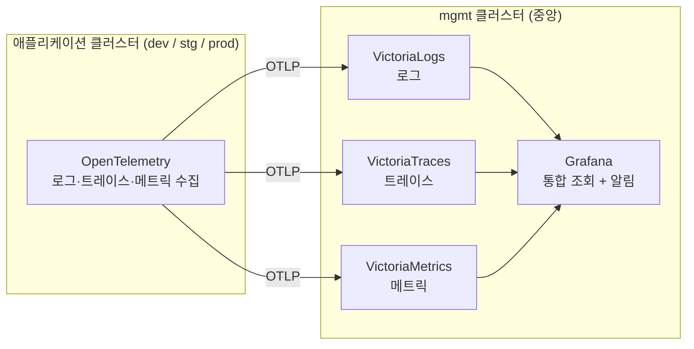
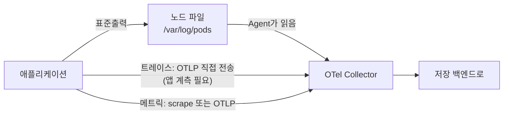
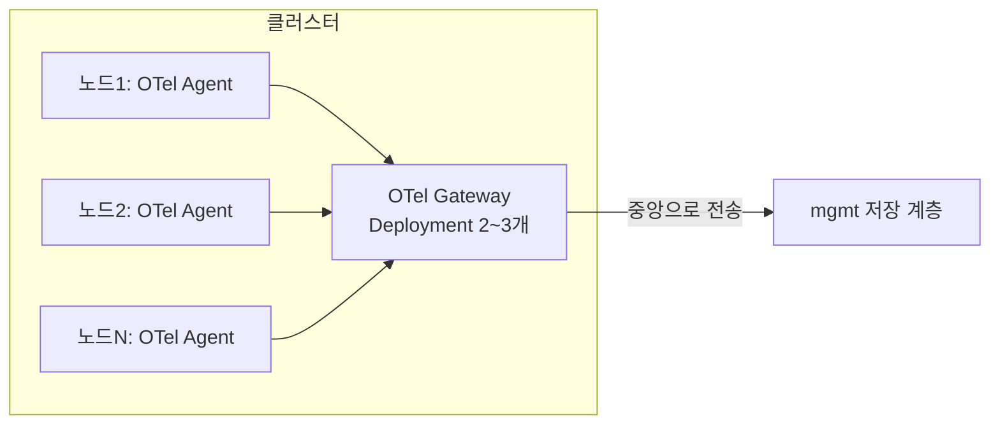
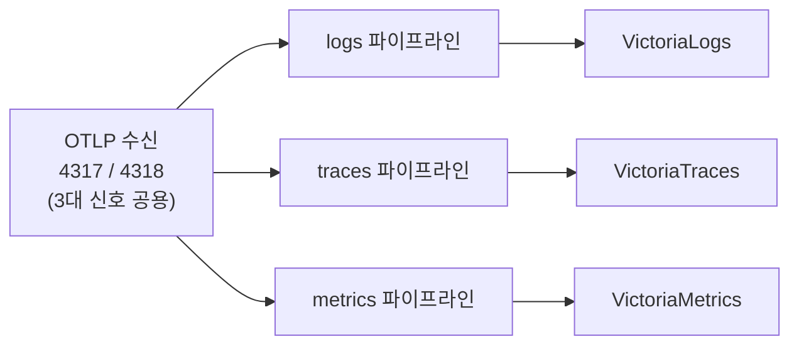
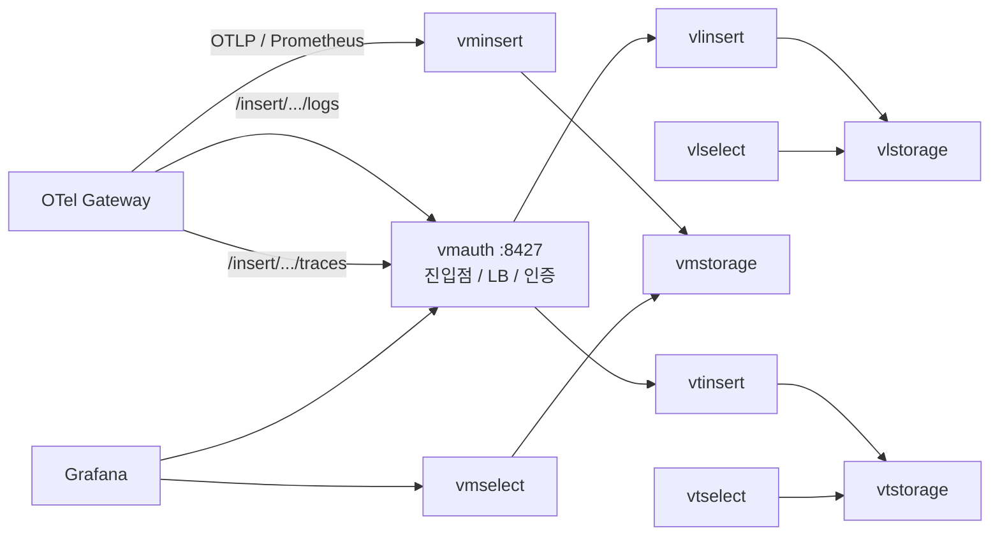
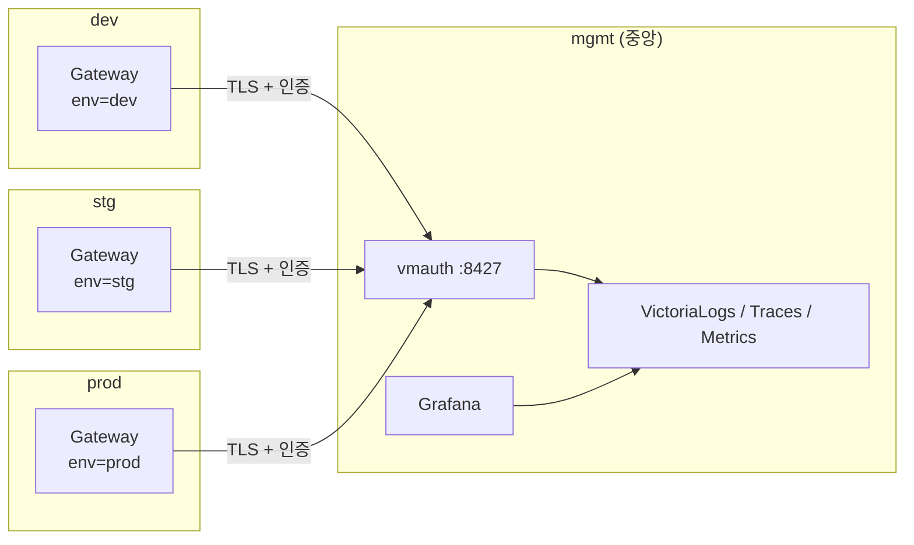
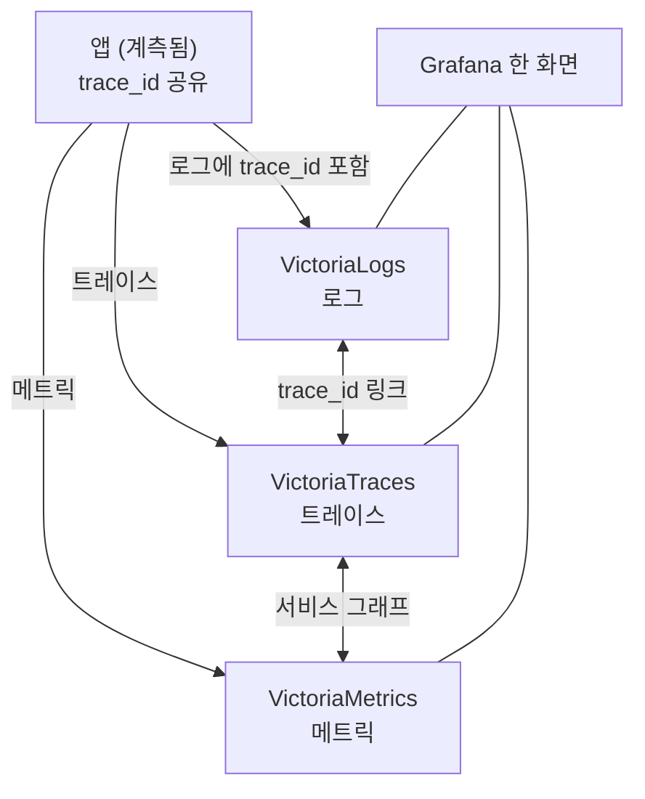
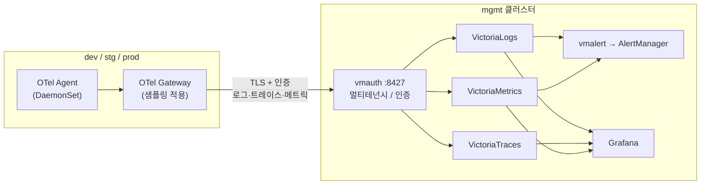

# 보고서용 다이어그램 모음 (mermaid)

각 코드를 mermaid.live 또는 VS Code mermaid 미리보기에서 렌더링한 뒤 캡처하여,
보고서의 `[다이어그램 N]` 자리에 이미지로 삽입하세요.

---

## 다이어그램 1: 전체 아키텍처 개요

---

## 다이어그램 2: 3대 신호의 수집 경로 차이

---

## 다이어그램 3: Agent/Gateway 2단 수집 구조

---

## 다이어그램 4: Gateway 내부의 신호별 파이프라인 분기

---

## 다이어그램 5: mgmt 저장 계층 상세 (VictoriaMetrics 생태계)

---

## 다이어그램 6: 멀티클러스터 중앙집중 토폴로지

---

## 다이어그램 7: trace_id 기반 신호 상관관계

---

## 다이어그램 8: 고급 요소를 포함한 최종 통합 구성도

